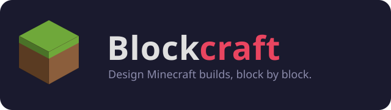

<p align="center">
  
</p>

<p align="center">
  <a href="https://yoyoda.github.io/blockcraft/"></a>
  
  
</p>

<p align="center">
  Plan Minecraft-style structures in your browser, one block at a time.<br>
  Draw layer by layer, watch it rise in 3D, no install needed.
</p>

<p align="center">
  <strong><a href="https://yoyoda.github.io/blockcraft/">▶ Try Blockcraft</a></strong>
</p>

---

## ✨ Features

- 🧱 **40 Minecraft-inspired blocks** — stone, wood, wool, ores and more, sorted by category
- ✏️ **2D layer editor** — pencil, eraser, line, rectangle, circle and sphere tools
- 🧊 **Live 3D viewer** — orbit, zoom and inspect your build as you draw
- 🗂️ **Layer tools** — duplicate, move, shift and clear layers independently
- 💾 **Save & load** — structures are stored locally in your browser
- ⬇️ **Import / export** — share builds as `.json` files
- ↩️ **Undo / redo** — the full history is always one shortcut away

## 🚀 Getting started

Blockcraft runs entirely in your browser — no account, no install:

**[yoyoda.github.io/blockcraft](https://yoyoda.github.io/blockcraft/)**

### Run it locally

Prefer to run it yourself? Blockcraft is a small [Vite](https://vitejs.dev/) app:

```bash
git clone https://github.com/Yoyoda/blockcraft.git
cd blockcraft
npm install
npm run dev
```

Open the local URL Vite prints in your terminal, and you're building.

## 🎮 How to use

1. **Pick a tool** in the palette — pencil, line, rectangle, circle or sphere
2. **Pick a material** — click any block swatch
3. **Draw** on the grid — left-click to place, right-click to erase
4. **Change layer** with the layer bar, or `Ctrl` + scroll on the canvas
5. **Pan** with middle-click or `Alt` + drag, **zoom** with the scroll wheel
6. Check your build in the **3D viewer** — drag to orbit, use the side slider to peel back layers
7. **Save**, **export** or start a **new** structure from the toolbar

### ⌨️ Shortcuts

| Action       | Shortcut                       |
|--------------|---------------------------------|
| Undo         | `Ctrl` + `Z`                    |
| Redo         | `Ctrl` + `Y`                    |
| Change layer | `Ctrl` + scroll wheel            |
| Pan canvas   | Middle-click, or `Alt` + drag   |
| Zoom canvas  | Scroll wheel                     |
| Erase        | Right-click                      |

## 🤝 Contributing

Blockcraft is open source, and pull requests are very welcome — new blocks, features, bug fixes or plain polish all count.

1. Fork the repo
2. Create a branch: `git checkout -b feature/my-idea`
3. Commit your changes
4. Open a pull request

Not sure where to start, or planning something bigger? Open an issue first, happy to discuss.

## 📄 License

MIT — see [LICENSE](LICENSE) for details.
